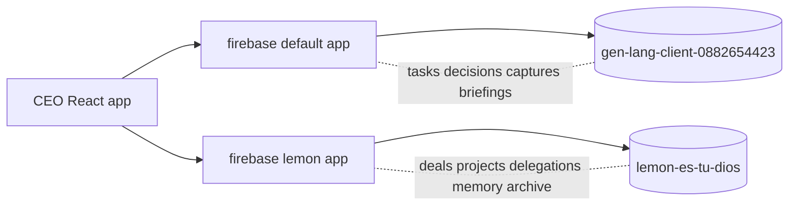

# 2026-05-09 — Ops Views Design

> Bring the highest-value LEMON-ES-TU-DIOS workspace surfaces into Lemon AI Center
> and turn the result into a real "one dashboard to rule them all" — without
> degrading the morning briefing flow that already works.

## 1. Goals

1. Add **Deals**, **Projects**, **Memory**, **Archive**, and **Inbox Intel** views
   to Lemon AI Center so Billy stops context-switching between the LEMON Firebase
   app and Lemon AI Center.
2. Improve the design beyond a literal port — full editorial design system
   fidelity, no glassmorphism artifacts.
3. Add inbox intelligence: surface what Billy must do today, what is silently
   slipping, and what's blocked on someone else, with one-click follow-up
   drafting in his voice via existing skills.
4. Keep the legacy `/` morning brief layout unchanged by default; gate the new
   views behind a feature flag.

## 2. Non-goals

- Retiring the LEMON SPA. It still hosts Python/Sheets automation flows and
  Spanish-first ops scripts. Out of scope.
- Migrating data between Firebase projects. We read LEMON's existing collections
  via a secondary Firebase app. Migration is a future milestone.
- Replacing CEO's existing `BrainPanel` (Notion brain). Memory is additive.
- Replacing CEO's existing `TasksPanel` bucket model. Eisenhower is a *view
  mode* on top of buckets, not a new task store.

## 3. Architecture

### 3.1 Two Firebase apps in one client

CEO uses Firebase project `gen-lang-client-0882654423` for `users/{uid}/...`
collections (tasks, decisions, captures, briefings, action log).

LEMON uses Firebase project `lemon-es-tu-dios` with top-level collections:

| Collection    | Purpose                                | Notes                       |
|---------------|----------------------------------------|-----------------------------|
| `deals`       | Sales/pipeline cards                   | `status`, `value`, `next_action`, `counterparty`, `owner`, `project` |
| `projects`    | Production projects across stages      | `category`, `format`, `platform`, `status_detail`, `next_action`, `sort_order` |
| `delegations` | Things Billy delegated to others       | `person`, `task`, `expected_by`, `status`, `created_at` |
| `memory`      | "Teach the AI" persistent rules        | `text`, `source`, `active`, `learned_at` |
| `archive`     | Snoozed / dismissed items              | `archived_at`, `briefing_date`, `restored` |
| `briefings`   | Daily morning briefs (LEMON's stack)   | Different format from CEO's `BriefDoc`; ignore here |

We add a new Firebase app **named** `"lemon"` initialized with the LEMON
config and never let it collide with the default app. CEO's existing
`firestore.ts` keeps using the default app.



### 3.2 New stores

Add Zustand stores under `src/stores/lemon/`:

- `useDealsStore`
- `useProjectsStore`
- `useLemonDelegationsStore`
- `useMemoryStore`
- `useArchiveStore`

Each store: `subscribe()` returns an unsub, holds an `items` array, and
exposes mutation methods that round-trip through the LEMON `db`. Mutations
are intentionally simple (no offline mutation queue yet) — these collections
are not on the morning-brief critical path.

### 3.3 View routing without react-router

CEO has no router today. We add a tiny string union view selector to a new
`useViewStore`:

```ts
type ViewId =
  | 'briefing'   // current Dashboard layout
  | 'inbox'      // new: inbox intelligence
  | 'deals'
  | 'projects'
  | 'memory'
  | 'archive'
```

`Dashboard.tsx` reads the current view and renders the matching component.
A new `WorkspaceTabs` lives directly under the editorial masthead (not in
the global `Header`) so the masthead stays focused on the brief.

This avoids:
- A new dependency (`react-router-dom`) for what is really tab state
- Touching `App.test.tsx`'s single render
- Splitting CEO's "open it once" mental model across URLs

A future migration to real routing is one swap of the store for `useParams`.

### 3.4 Feature flag

Add `VITE_OPS_VIEWS=true` to enable the workspace tabs and new views. When
unset (or `false`) the dashboard renders exactly as it does today. The
existing `VITE_NEW_DASHBOARD` flag is independent.

## 4. Design language

All ported surfaces drop the LEMON glass aesthetic and use CEO tokens from
`src/styles/globals.css` and `tailwind.config.ts`:

- Surfaces: `bg-bg-surface` with `border-border-soft`, rounded `xl`
- Headers: `text-[10px] uppercase tracking-widest text-text-muted` (matches
  existing panels like `InboxPanel`, `TasksPanel`)
- Display: Fraunces for board names and big numbers; Inter for everything
- Accents: lemon for primary CTA / active stage; coral for HOT/blocking
  status; sage for healthy / shipped; blue for info; rose for destructive
- No backdrop blur, no semi-transparent glass; surfaces are opaque

Each board uses the new `BoardKanban` primitive (single component, multiple
column configs).

## 5. Inbox Intelligence (the heart of this milestone)

This is what makes the new dashboard meaningfully better, not just bigger.

### 5.1 Surfaces

A new `InboxIntelView` with three lanes:

1. **Slipping** — threads where Billy is the owner, age > 48h, no reply yet,
   priority is HOT or MED. Sorted oldest-first.
2. **Blocked on others** — open `delegations` with `status === 'pending'` and
   `expected_by` < today, joined with the gmail thread when a thread id is
   present. Has a one-click *Nudge* affordance that opens the existing
   `ReplyModal` pre-filled with a follow-up draft.
3. **Tied to deals & projects** — threads where the subject or sender domain
   matches an active deal `name`/`counterparty` or project `title`. Lets
   Billy see ops surfaces from inside the inbox lens.

### 5.2 "What am I missing?" command

A primary CTA at the top of the view: *Ask AI: what am I missing?*. Opens
`BillyDrawer` with a prefilled prompt that bundles:

- The "slipping" thread set
- Pending delegations
- Today's calendar
- Active deals at risk (no `next_action` or `next_action` updated > 7 days)

Re-uses existing skills infrastructure — no new server endpoints required
in this milestone. A future iteration will add a dedicated server route
that returns structured `Claim` objects.

### 5.3 Reply in voice

Existing `ReplyModal` already handles voice-aware drafting. From any thread
card we link directly to it instead of building a new editor.

## 6. Files (concrete delta)

```
docs/superpowers/specs/2026-05-09-ops-views-design.md   (new — this doc)
shared/types.ts                                          (extend)
src/lib/firestoreLemon.ts                                (new)
src/stores/useViewStore.ts                               (new)
src/stores/lemon/useDealsStore.ts                        (new)
src/stores/lemon/useProjectsStore.ts                     (new)
src/stores/lemon/useLemonDelegationsStore.ts             (new)
src/stores/lemon/useMemoryStore.ts                       (new)
src/stores/lemon/useArchiveStore.ts                      (new)
src/components/workspace/WorkspaceTabs.tsx               (new)
src/components/workspace/BoardKanban.tsx                 (new)
src/components/workspace/BoardCard.tsx                   (new)
src/components/workspace/EmptyState.tsx                  (new)
src/components/views/BriefingView.tsx                    (new — wraps current dashboard body)
src/components/views/DealsView.tsx                       (new)
src/components/views/ProjectsView.tsx                    (new)
src/components/views/MemoryView.tsx                      (new)
src/components/views/ArchiveView.tsx                     (new)
src/components/views/InboxIntelView.tsx                  (new)
src/components/Dashboard.tsx                             (edit — view-aware)
.env.example                                             (edit — add LEMON vars + flag)
```

## 7. Risks & mitigations

| Risk | Mitigation |
|------|-----------|
| LEMON Firebase rules require auth that CEO's anonymous Firebase auth lacks | Treat reads as best-effort; fall back to a clear "Connect LEMON workspace" empty state. The current LEMON rules are open in dev — production hardening tracked separately. |
| `firestore.indexes.json` differs from CEO's | LEMON-specific indexes already exist in the LEMON project; we only read against that project so no migration. |
| Tab-state routing breaks deep links | Acceptable for V1; convert to `react-router-dom` in a future PR if Billy starts sharing URLs. |
| Two Firebase apps inflate bundle size | The Firebase JS SDK already supports multi-app and the LEMON app reuses the same modules; impact is negligible. |
| Bundle bloat from `@dnd-kit` | We use native HTML5 drag-and-drop (HTMLDataTransfer) instead. Zero new deps. |
| Eisenhower view duplicates Tasks | Render Eisenhower as a *toggle* on `TasksPanel`, not a separate page. |

## 8. Phasing

- **P1 (this milestone)**: Workspace tabs, Deals, Projects, Memory, Archive,
  Inbox Intel scaffold (heuristic-based slip detection).
- **P2**: Eisenhower toggle on TasksPanel + AI-summarized "what's slipping"
  via new server route + cross-doc linking (deal ↔ thread ↔ task).
- **P3**: Migrate LEMON collections under `users/{uid}/...` in CEO's
  Firebase project; retire the secondary app; sunset the LEMON SPA.

## 9. Acceptance

- `VITE_OPS_VIEWS=false` (default): dashboard is byte-identical to today.
- `VITE_OPS_VIEWS=true`: tabs render under masthead, all five new views load
  without runtime errors, deals/projects support drag-between-columns,
  memory/archive show LEMON data when env vars are present, inbox intel
  lists "slipping" threads using existing `useInboxStore` data.
- Tests: `App.test.tsx` keeps passing; one new render test per view.
